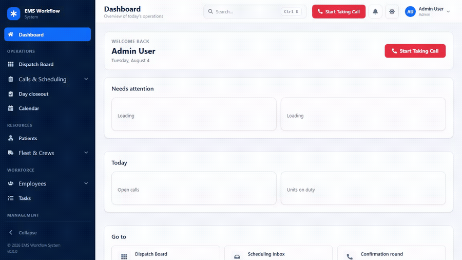
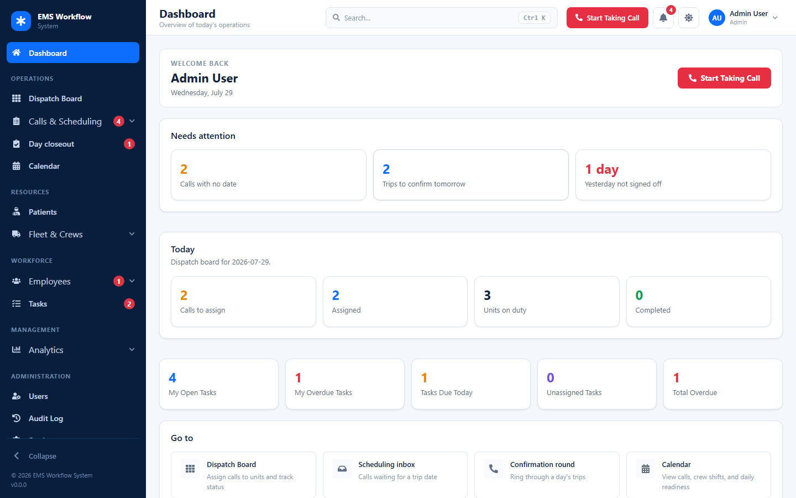
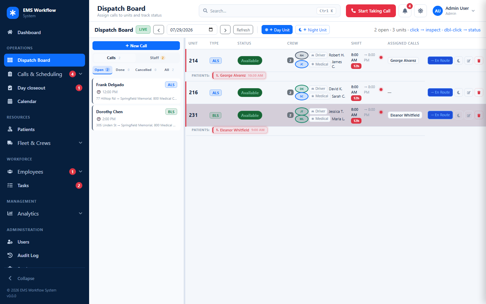
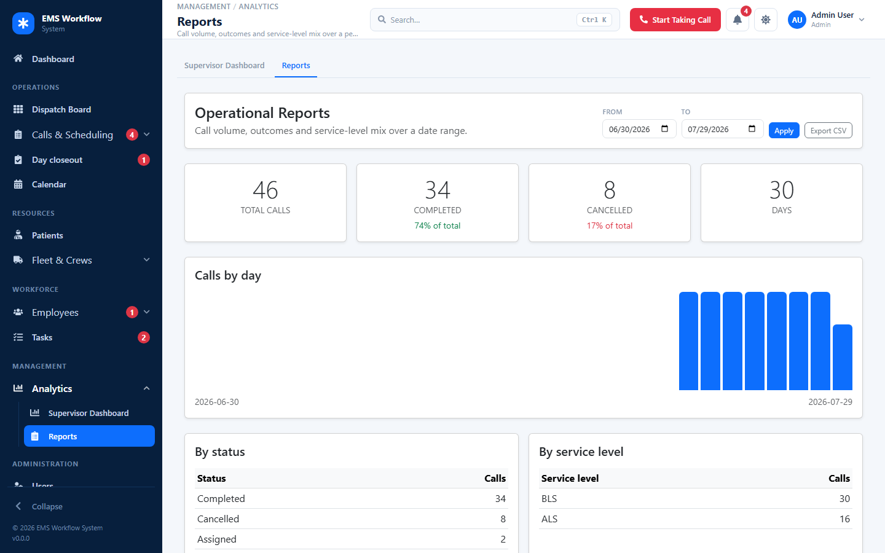
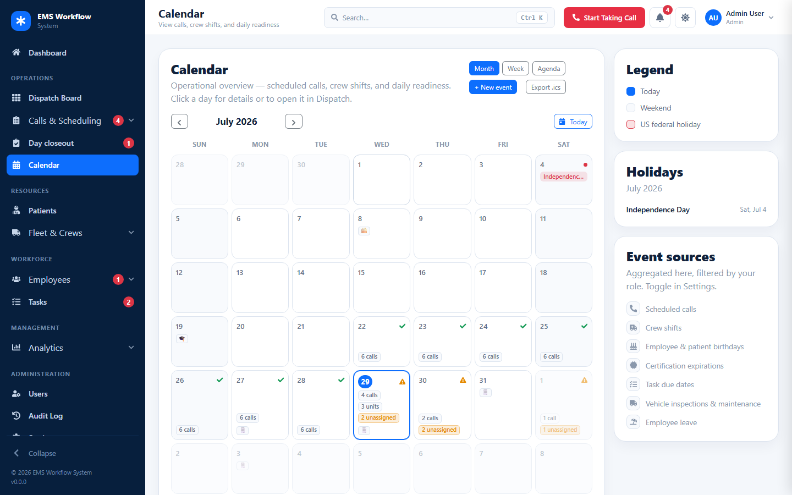
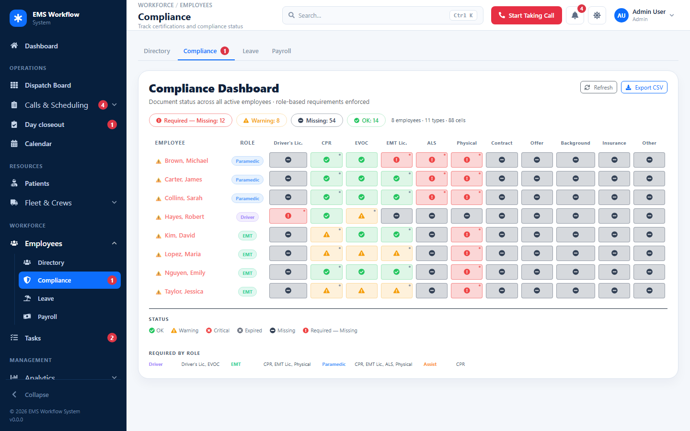
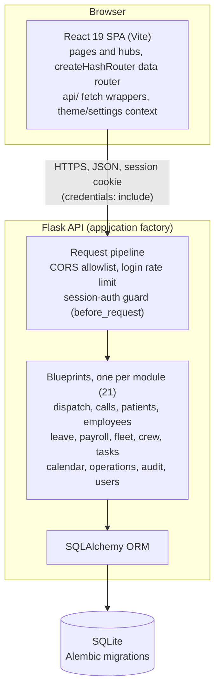
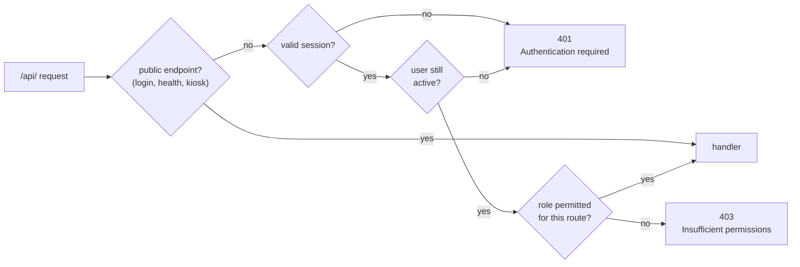

# EMS Workflow System

**Developer:** [alehsitsko.dev](https://alehsitsko.dev)

## Portfolio Summary

EMS Workflow System is a full-stack React + Flask application built from real EMS dispatch and operations experience. It demonstrates operational workflow design, role-based interfaces, dispatch assignment logic, patient operational records, HR document tracking, payroll support, notifications, audit logging, and production-readiness planning.

## Overview

A lightweight EMS/NEMT operations management platform focused on call intake, dispatch workflow, crew planning, patient operational records, HR/staff management, time/payroll support, tasks, notifications, audit logging, and supervisor oversight.

It is not intended to replace primary dispatch software, CAD systems, EMR systems, clinical documentation systems, or billing platforms — see [Current Scope](#current-scope) below for the precise boundary.

## Download (Windows desktop)

A standalone, **offline-capable Windows desktop build** is available — an Electron shell over the *same* Flask backend and React frontend, with a local SQLite database. No Python, Node, Docker, or internet required.

* **[⬇ Download the installer (direct)](https://github.com/AlehSitsko/ems-workflow-system/releases/latest/download/EMS-Workflow-System-Setup.exe)** — `EMS-Workflow-System-Setup.exe` (~103 MB), always the latest release. Or browse **[all releases](https://github.com/AlehSitsko/ems-workflow-system/releases/latest)**.
* Installs **per-user** (no administrator rights). On first run it asks you to create a local administrator account; no demo data is seeded.
* The build is **unsigned**, so Windows SmartScreen warns on first launch — click *More info → Run anyway*. (See [desktop/README.md](desktop/README.md) for the code-signing path.)
* Your data (database, uploads, logs, backups) lives under `%APPDATA%`, **outside** the install folder, and survives updates and uninstalls. Backup/restore is in the app's **File** menu.

Architecture, data locations, backup/restore, offline behaviour, and building the installer from source are documented in **[desktop/README.md](desktop/README.md)**. The web version is unaffected and continues to build and deploy as before.

## Current Scope

**In scope:**

* EMS/NEMT operations workflow
* Call intake (Classic and Guided modes)
* Live dispatch board with drag-and-drop assignment
* Patient operational records (not clinical documentation)
* Crew planning (day/night shifts, vehicle registry, shift timing)
* Employee/HR records and certification tracking
* Time tracking and payroll support (FLSA overtime, CSV/Gusto/ADP export)
* Staff task assignment and tracking
* In-app notifications (bell + browser push)
* Audit logging
* Per-user settings
* Supervisor oversight and analytics

**Not in current scope:**

* Full clinical ePCR
* NEMSIS / state submission
* Insurance claims processing
* HIPAA-grade production deployment
* Live GPS / routing
* Monitor integration
* Hospital EMR integration

## This System Is

* An EMS/NEMT operations workflow platform
* A dispatcher support platform
* A patient lookup and call intake tool
* A staff management platform
* An HR document management platform
* A crew planning platform (day and night shifts)
* A live dispatch board platform
* A time tracking and payroll support platform
* A supervisor analytics platform

## This System Is Not

* A replacement for primary dispatch software
* A CAD platform
* An EMR platform
* A hospital management system
* A clinical documentation system
* A full billing system

## Feature Highlights

* **Call Intake** — Classic and Guided modes, patient lookup with duplicate prevention, quality scoring, price calculator
* **Dispatch Board** — open calls, drag-and-drop assignment, unit status lifecycle with timestamps, return rides, cancel/reopen, priority queue, overdue/stuck alerts. Reads `?date=` and runs in **Planning / Live / History** modes, enforced **on the backend** (`409`), not just by disabled buttons: Planning (future) allows crew shifts + assignment + queue but no live lifecycle; Live (today) allows everything; History (past) is read-only. Cross-date assignment and past assignment are rejected; board dates must be real calendar dates
* **Calendar** — read-only operational calendar that aggregates existing records (never a duplicate store): month view with per-day readiness, weekend + US federal holidays, a Day Operations drawer, and one-click "Open Day in Dispatch Board". Sources: scheduled calls, crew shifts, patient & employee birthdays, certification expirations, task due dates, and vehicle compliance/maintenance dates. Role-filtered on the backend (HR gets crew-only, no PHI; dispatcher sees certifications without employee names), with per-user display settings
* **Patients** — operational records, dispatch comments, transport instructions, alerts, contacts, soft archive
* **Crew Planner** — daily units, day/night shifts, shift duration & delay alerts, certification-checked crew validation
* **Fleet** — the physical vehicles, separate from the daily crew units that use them: `/fleet/vehicles` list plus a full Vehicle Workspace (`/fleet/vehicles/:id`) with Overview, Compliance and Activity. Admin/supervisor manage, dispatchers get read-only availability, HR has no access
* **Employees / HR** — the Employees hub gathers the Directory, Compliance, Leave and Payroll; an employee's own page is a workspace with Overview, Qualifications, Documents, Time & Pay, Tasks, Schedule, Activity and Leave tabs, each backed by a real endpoint and deep-linkable via `?tab=`
* **Time / Payroll** — kiosk clock-in/out, time entries, pay periods, FLSA overtime, CSV/Gusto/ADP export
* **Tasks** — staff task assignment, comments, activity log, role-scoped permissions, creator/assigner-only closing
* **Notifications** — in-app bell, per-user preferences, browser push (VAPID)
* **Audit Log** — global action logging across every module
* **Settings** — server-side per-user preferences (time format, notification prefs, dispatch thresholds, panel layout)
* **UI System** — two-level role-filtered navigation from one config, consistent sidebar/topbar layout, dark/light theme tokens, standardized drawer/modal/toast patterns (see [docs/UI_STANDARD.md](docs/UI_STANDARD.md) and Navigation & Information Architecture below)

For the full history of what shipped and when, see [docs/COMPLETED_BLOCKS.md](docs/COMPLETED_BLOCKS.md).

## Navigation & Information Architecture

The sidebar is two levels deep. Related pages are grouped into **hubs** — a hub is
a disclosure control, not a route, so every page keeps its own URL and can still
be opened directly or bookmarked.

```text
Dashboard
OPERATIONS      Dispatch Board · Calls & Scheduling ▾ · Day Closeout · Calendar
RESOURCES       Patients · Fleet & Crews ▾
WORKFORCE       Employees ▾ · Tasks
MANAGEMENT      Supervisor Dashboard
ADMINISTRATION  Users · Audit Log · Settings
HELP            Kiosk · User Manual
```

Hubs and their pages:

| Hub | Pages | Routes |
|---|---|---|
| **Calls & Scheduling** | All Calls, Scheduling Inbox, Recurring Trips, Confirmations | `/calls`, `/scheduling-inbox`, `/recurring-trips`, `/confirmation-round` |
| **Fleet & Crews** | Crew Planner, Vehicles | `/crew-planner`, `/fleet/vehicles` |
| **Employees** | Directory, Compliance, Leave, Payroll | `/employees`, `/compliance`, `/leave`, `/payroll` |

**One source of truth.** `frontend/src/config/routeMetadata.js` holds both the
per-route metadata (title, subtitle, icon, permission, width) and `NAV_SECTIONS`,
the menu's shape. The shape references routes by path only — labels, icons and
permissions are always read back from the route entry, so the sidebar, the
dashboard's quick links, the module tabs and the command palette cannot disagree
about what a page is called or who may open it.

**Filtering cascades.** A hub whose every child is denied disappears; a section
left with no items disappears with it, so no role sees a heading over nothing. A
hub reduced to a single permitted child collapses into a plain link — the same
rule for every hub and every role.

**Global quick actions.** Taking a call is an action rather than a place: it has
no menu entry. **Start Taking Call** sits in the header on every page, the
dashboard carries the same action as its primary CTA, and **New Call** appears
beside the Calls & Scheduling tabs. The route (`/call-form`) and its permission
are unchanged, and both Classic and Guided intake modes are untouched.

**Menu visibility is not security.** `canAccess` decides what is *shown*. Route
guards in `App.jsx` and the API's own role checks are the boundary — see
`backend/utils/auth_utils.py` and `backend/tests/test_security.py`.

## Screenshots

The repo ships a one-command demo dataset so the app looks populated and current
the moment you open it — recognisable crews and patients, a week of completed and
cancelled trips, today's board fully crewed, a few expiring certifications, and a
recurring staff meeting, all dated relative to *today*:

```powershell
flask --app app seed-demo-data   # local/demo only; see "Demo Users / Demo Mode"
```

### Workflow
A dispatcher's path through the app — dashboard, the live Dispatch Board, and the
operational calendar:



### Dashboard
Role-aware "needs attention" plus today's operational snapshot.



### Dispatch Board
Crewed units, open vs assigned calls, and Planning / Live / History date modes.



### Reports
Call volume, completion / cancellation rates, a per-day chart and CSV export.



### Calendar
Aggregated calls, crew shifts, birthdays, certifications and manual events.



### Compliance
Certifications across the roster, colour-coded by expiry.



> Regenerate these from the seeded demo: run the backend (against a demo DB) and
> the frontend dev server, then `cd frontend && npm run screenshots`
> (`scripts/capture-screenshots.mjs`, Playwright — `npx playwright install chromium` once).
> The workflow GIF regenerates the same way via `cd frontend && npm run record-gif`
> (`scripts/record-workflow-gif.mjs`; needs `ffmpeg` on PATH or `FFMPEG=…`).

## Tech Stack

**Frontend:** React 19, Vite 7, React Router 7 (`createHashRouter` data router), Bootstrap 5.3 (native dark mode), CSS Custom Properties design tokens, React Icons.

**Backend:** Python, Flask, Flask Blueprints, Flask-CORS, Flask-Limiter, Flask-Migrate (Alembic), SQLAlchemy.

**Database:** SQLite for local development and the desktop build; PostgreSQL for production (supported via the production Docker stack) — see [docs/PRODUCTION_READINESS.md](docs/PRODUCTION_READINESS.md).

Full module map and data flow: [docs/ARCHITECTURE.md](docs/ARCHITECTURE.md).

## Architecture

A single-page React client talks to a Flask API over JSON. Identity is a signed,
HttpOnly **session cookie** — the client never asserts its own role. The one
compose file below runs both dev servers for a reproducible local environment.



*One `docker compose up` runs both dev servers (frontend + backend) for a
reproducible local environment — see [docs/DOCKER.md](docs/DOCKER.md).*

**Request path & authorization.** Every `/api/` request passes one guard before
any handler runs: it requires a session, re-validates the signed-in user against
the database on each request (so disabling an account or changing a role takes
effect immediately), then the route's own role check decides access. Hiding a
link is never the boundary — the API is.



## Quick Start

### Docker (everything at once)

```bash
docker compose up --build
```

Frontend on <http://127.0.0.1:5173/ems-workflow-system/>, backend on
<http://127.0.0.1:5050>. Migrations run on startup; demo users are seeded only
when you ask (`docker compose exec backend flask --app app seed-demo`).
Development environment only — see [docs/DOCKER.md](docs/DOCKER.md).

To run the two services directly instead:


### Backend

```powershell
cd backend
python -m venv venv
.\venv\Scripts\Activate.ps1
pip install -r requirements.txt
flask --app app db upgrade    # build the schema (Flask auto-detects the create_app factory)
flask --app app seed-demo     # create demo users (idempotent; local/demo only)
flask --app app seed-demo-data # optional: a full operational demo dataset for screenshots
python app.py                 # dev server on http://127.0.0.1:5050
```

The backend uses a Flask **application factory** (`create_app` in `app.py`).
Importing it has no side effects — it does not open the database or seed data.
The schema is managed entirely through Flask-Migrate; a fresh database **must**
be migrated (`flask --app app db upgrade`) before first run, or you'll see
errors like `no such table: user`. Demo users are created **only** by the
explicit `seed-demo` command, never on normal startup.

### Frontend

```powershell
cd frontend
npm install
npm run dev      # dev server, http://localhost:5173
npm run lint      # ESLint
npm run build     # production build
```

### Tests

```powershell
# Backend — the full pytest suite (in-memory SQLite, no server needed).
# Coverage is gated in CI (see backend/.coveragerc); run `pytest --cov` for the report.
cd backend; pytest -v

# Frontend — the Vitest suite (utilities + component tests).
# Coverage is gated in CI; run `npm run test:coverage` for the report.
cd frontend; npm test

# End-to-end — 8 Playwright spec files (20 test cases) against a disposable,
# migrated + seeded backend that Playwright boots and tears down itself
cd frontend; npm run test:e2e

# Live QA (optional) — these SELF-BOOT a disposable SQLite backend by default; a
# pre-running backend is used only with EMS_QA=1 (qa_mode:true). Never the dev DB.
python qa_test.py       # functional/integration checks
python stress_test.py   # local load smoke (not a production benchmark)
```

CI (`.github/workflows/ci.yml`) runs six jobs on every PR and push to
`dev`/`main`: **backend** (Ruff lint + pytest + coverage gate), **frontend** (ESLint
+ Vitest + coverage gate + build), **E2E** (Playwright on a disposable backend),
**Docker** — which builds the images and **smoke-tests the production stack**
(PostgreSQL + Gunicorn + Nginx brought up with `docker compose --wait`, then a
`/api/health` check plus a real-browser prod smoke), so the migration chain is
exercised against real PostgreSQL — **Desktop** (Electron + PyInstaller build smoke,
Windows), and **Dependency audit** (`pip-audit` + `npm audit`). See
[docs/TESTING.md](docs/TESTING.md) for
coverage detail and the disposable-database rule for the live scripts, and
[docs/DEVELOPMENT_WORKFLOW.md](docs/DEVELOPMENT_WORKFLOW.md) for the pre-commit
checklist.

## Demo Users / Demo Mode

Created by `flask --app app seed-demo` (idempotent — existing usernames are
skipped). **Not** seeded on normal startup. For local/demo use only:

| Username | Password | Role |
|---|---|---|
| admin | admin | admin |
| supervisor | supervisor | supervisor |
| dispatcher | dispatcher | dispatcher |
| hr | hr | hr |

The **employee self-service portal** login (`jcarter` / `employee`, an `employee`
role linked to a demo employee) is created by `seed-demo-data`, not `seed-demo`,
because it needs a linked employee record to show a schedule, tasks and leave.

For a populated app (employees, patients, fleet, today's crews, a week of calls,
tasks and a recurring event), run `flask --app app seed-demo-data`. It ensures the
demo users exist, then builds the dataset — and refuses to run on a database that
already has records (pass `--force` to override). Local/demo only; never in
production.

## Project Structure

```text
ems-workflow-system/
├── backend/       Flask app, models, Alembic migrations, one blueprint per module
├── frontend/      React + Vite app — pages, components, api/ wrappers, context, hooks
├── docs/          Architecture, API reference, roadmap, testing, Docker, production readiness, UI standard
├── docker-compose.yml  Reproducible dev environment (development only)
├── qa_test.py     Functional/integration test script
├── stress_test.py Load test script
└── TODO.md        Actionable near-term backlog
```

Full breakdown: [docs/ARCHITECTURE.md](docs/ARCHITECTURE.md).

## Current Status

Stable. All core modules (Call Intake, Dispatch Board, Calendar, Patients, Crew Planner, Fleet/Vehicles, Employees/HR, Time & Payroll, Staff Tasks, Notifications, Audit Log, Settings, Supervisor Dashboard) are implemented. Automated coverage: **1068 backend pytest tests + 466 frontend Vitest tests + 8 Playwright E2E spec files (20 cases)** (snapshot at `v1.1.12`; regenerate with `pytest --co -q` / `vitest run` — both suites are coverage-gated in CI, so the live gate is the authoritative check), plus the live `qa_test.py` smoke suite. A client/server **infrastructure evolution** (multi-tenant isolation, invite-only onboarding, an event bus + SSE, a notification engine, optional field-level encryption at rest, and a Local/S3 storage abstraction) has shipped on top of the core — all while keeping the standalone/local deployment intact; see [docs/INFRASTRUCTURE_REPORT.md](docs/INFRASTRUCTURE_REPORT.md).

Full changelog: [docs/COMPLETED_BLOCKS.md](docs/COMPLETED_BLOCKS.md).

## Current Development Direction

The core product and the production-hardening phase have shipped; what remains is
deliberately-deferred, externally-dependent work plus a standalone desktop build.
Full detail in [docs/ROADMAP.md](docs/ROADMAP.md); near-term items in
[TODO.md](TODO.md).

**Shipped** (much of the early docs' "planned" work is now done):
* The full operational **Calendar** — calls, crew shifts, birthdays,
  certifications, task deadlines, vehicle dates, and manual events with recurrence
  and ICS export; **Month / Week / Agenda** views; time-overlap double-booking and
  vehicle-availability **conflict detection**.
* A **Docker** development environment *and* a production stack
  (Gunicorn / Nginx / PostgreSQL) with backup/restore, structured logging and
  Prometheus metrics.
* A full **security** line — CSRF tokens, a password policy (complexity, optional
  expiry, no-reuse history), per-device server-side session revocation,
  `SECRET_KEY` rotation, rate limiting, content-based upload validation, and
  **active runtime tenant isolation** with subdomain multi-tenancy and a platform
  super-admin console.

**Shipped:** a standalone **Windows desktop build** (an Electron shell over the
same React frontend and Flask backend, local SQLite, offline-capable), living
alongside the web version — see [Download](#download-windows-desktop) and
[desktop/README.md](desktop/README.md).

**Deferred (external dependency / research):** Google/Outlook two-way calendar
sync (needs OAuth + a privacy policy) and route optimization.

## Known Limitations

* SQLite is the datastore for local development and the desktop build; production
  web deployments use PostgreSQL (see the production Docker stack).
* The system is not a clinical ePCR and does not do NEMSIS export, insurance
  claims processing, or live GPS routing — out of scope by design.
* External calendar sync (Google/Outlook) and route optimization are deferred;
  ICS **export** of manual events is supported.
* Production web deployment still requires the operator to supply TLS termination
  and, for subdomain multi-tenancy, DNS plus a wildcard certificate.
* Test coverage spans the backend pytest and frontend Vitest suites (both run in
  CI) plus the live `qa_test.py` / `stress_test.py` runners — see
  [docs/TESTING.md](docs/TESTING.md) for the current breakdown rather than a
  hard-coded count that drifts.

## Security Note

Authentication is **server-side session cookies**: signing in starts a session,
the cookie is signed with `SECRET_KEY`, `HttpOnly` and `SameSite=Lax`, and the
API reads identity from it alone. This replaced `X-User-*` headers that the
server used to trust — anyone who could reach the API could previously claim
`admin` with a curl flag. Every `/api/` route now requires a session unless it
is on a short, tested allowlist (login, health, the kiosk), so a new route is
protected by omission rather than exposed by it.

Two serious exposures were found and closed while doing this: user
administration had no gate at all (an anonymous POST could create an admin
account), and 74 routes were reachable anonymously — including patient and call
records. Both are pinned by regression tests.

**Implemented and regression-tested:** **CSRF** double-submit tokens on every
mutation; a **password policy** (complexity, optional expiry, no-reuse history);
**per-device server-side session revocation**; **`SECRET_KEY` rotation** via
fallback keys; **rate limiting** on login and the kiosk PIN; **content-based
upload validation** with download-only serving; a per-route **authorization
audit**; and **active runtime tenant isolation** (an ORM-layer filter on every
org-scoped query, subdomain org routing, and a platform super-admin console).

**Deployment-dependent, not code:** TLS termination, a real `SECRET_KEY` from a
secret store, and — for subdomain multi-tenancy — DNS plus a wildcard TLS
certificate. See [docs/PRODUCTION_READINESS.md](docs/PRODUCTION_READINESS.md).

## Documentation

* [docs/ARCHITECTURE.md](docs/ARCHITECTURE.md) — module map, data flow, auth state, database/migration notes, multi-tenancy foundation
* [docs/API.md](docs/API.md) — full backend API endpoint reference
* [docs/ROADMAP.md](docs/ROADMAP.md) — prioritized roadmap (P0–P6)
* [docs/TESTING.md](docs/TESTING.md) — current test coverage and test roadmap
* [docs/PRODUCTION_READINESS.md](docs/PRODUCTION_READINESS.md) — production hardening plan
* [docs/INFRASTRUCTURE_REPORT.md](docs/INFRASTRUCTURE_REPORT.md) — client/server infrastructure evolution (tenant isolation, onboarding, events/SSE, encryption, object storage)
* [docs/DEPLOYMENT_TLS.md](docs/DEPLOYMENT_TLS.md) — putting TLS in front of the production stack (Caddy / Nginx / cloud LB)
* [docs/SECURITY_AUDIT.md](docs/SECURITY_AUDIT.md) — experimental verification of encryption-at-rest, org-key isolation, key failure/rotation, and tenant isolation
* [docs/DATA_CLASSIFICATION.md](docs/DATA_CLASSIFICATION.md) — sensitive-field classification, current encryption coverage, and the staged plan for gaps
* [docs/OPERATIONS_RUNBOOK.md](docs/OPERATIONS_RUNBOOK.md) — production TLS, secrets & encryption-key backup, backups, disaster recovery, S3, monitoring
* [docs/DEVELOPMENT_WORKFLOW.md](docs/DEVELOPMENT_WORKFLOW.md) — branch strategy, pre-commit checklist, manual verification checklist
* [docs/UI_STANDARD.md](docs/UI_STANDARD.md) — UI patterns and design tokens
* [docs/COMPLETED_BLOCKS.md](docs/COMPLETED_BLOCKS.md) — full changelog
* [TODO.md](TODO.md) — actionable near-term backlog

## License

Released under the [MIT License](LICENSE) — free to use, modify, and distribute
with the copyright notice retained. The software is provided **as is, without
warranty of any kind**.

**Not for clinical or production use.** This is a portfolio project and must not
be used to manage real patients or store real patient data (PHI). It is not a
clinical ePCR, does not implement NEMSIS or HIPAA-grade safeguards, and carries
no warranty or fitness for medical operations.

## Author

Created by Aleh Sitsko.
Built from real EMS dispatch experience.
